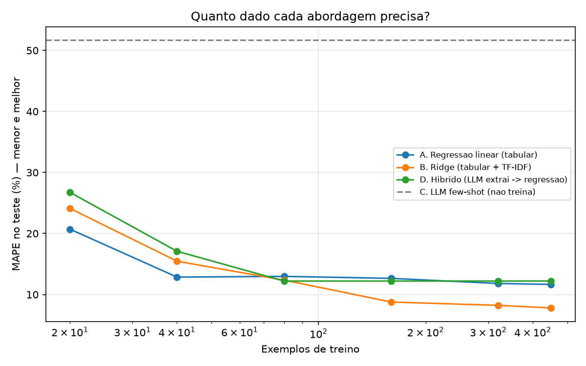

# Precificação de imóveis: LLM vs. modelo clássico

Um mesmo problema de regressão resolvido por quatro caminhos, avaliados no **mesmo split de teste**, com as **mesmas métricas**. A pergunta não é "qual modelo é melhor", é **quando cada abordagem compensa**.

## O problema

Estimar o preço de venda de um imóvel a partir de um anúncio. Cada anúncio tem colunas estruturadas (área, quartos, banheiros, vagas, idade, bairro) e um **texto livre**.

O detalhe que define o experimento: o preço real também depende de quatro atributos — reforma recente, mobília, vista livre e ruído do entorno — que **não existem em coluna nenhuma**. Eles aparecem só no texto, de forma indireta ("de frente para uma avenida de trafego intenso", "acabamento da época da construção"). Juntos, esses atributos movem o preço em até ±30%.

Ou seja: quanto do sinal escondido na linguagem natural cada abordagem consegue recuperar?

## As quatro abordagens

| | Abordagem | Usa o texto? | Treina? |
|---|---|---|---|
| **A** | Regressão linear, só colunas tabulares | não | sim |
| **B** | Ridge com tabular + TF-IDF do anúncio | sim, como bag-of-words | sim |
| **C** | LLM few-shot estimando o preço direto | sim, semanticamente | não |
| **D** | **Híbrido**: LLM extrai os 4 atributos → entram na regressão linear de A | sim, como extratora | sim |

**B existe de propósito.** Comparar uma LLM com um baseline que ignora o texto seria um espantalho — TF-IDF pega "reformado" e "avenida" sozinho e recupera boa parte do sinal. **C recebe 12 exemplos com preço** pelo mesmo motivo: sem âncora de mercado, a LLM não teria como acertar o patamar de preços, e a comparação seria desonesta na direção oposta.

## Resultados

<!-- cole aqui a saída de results/tabela_comparativa.csv -->



O gráfico é o entregável principal: os modelos treináveis melhoram com mais dados, a LLM few-shot é uma linha horizontal (não aprende com o dataset). Onde as linhas se cruzam é a resposta prática para "vale a pena chamar a API?".

## Como rodar

```bash
pip install -r requirements.txt
python src/gerar_dados.py         # gera data/anuncios.csv
python src/comparar.py            # roda A e B; roda C e D se houver chave

export ANTHROPIC_API_KEY=...      # para as abordagens com LLM
```

Todas as respostas da API ficam cacheadas em `cache/`, então rodar de novo não gasta nada e o resultado é reproduzível.

## Sobre os dados

O dataset é **sintético**, gerado por `src/gerar_dados.py` com uma função de preço conhecida mais ruído gaussiano de 6% (o piso de erro que nenhum modelo consegue furar). Isso é uma escolha deliberada: com dados reais eu não saberia o valor verdadeiro dos atributos latentes e não poderia medir separadamente **se a LLM extraiu certo** dos atributos e **se o modelo precificou certo**. O gabarito latente fica em `data/gabarito_latente.csv` e só é usado na análise de erro, nunca no treino.

A contrapartida honesta: nenhuma conclusão aqui é sobre o mercado imobiliário. As conclusões são sobre o comportamento comparado dos métodos.

## Estrutura

```
src/gerar_dados.py   # dataset sintético + gabarito
src/classico.py      # baselines A e B, split compartilhado
src/llm.py           # abordagens C e D, com cache e contagem de custo
src/metricas.py      # MAE, RMSE, MAPE, R² — iguais para todo mundo
src/comparar.py      # roda tudo, gera tabela, gráfico e análise de erro
```
